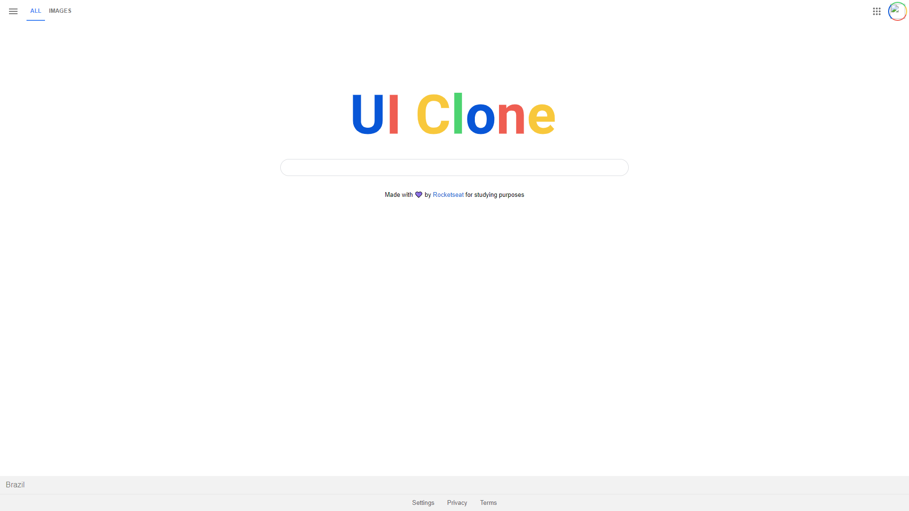

<h1 align="center">
  🐾 Clone da Homepage da Google
</h1>

  <a href="#rocket-tecnologias">Tecnologias</a>&nbsp;&nbsp;&nbsp;|&nbsp;&nbsp;&nbsp;
  <a href="#-projeto">Projeto</a>&nbsp;&nbsp;&nbsp;|&nbsp;&nbsp;&nbsp;
  <a href="#-layout">Desenvolvimento</a>&nbsp;&nbsp;&nbsp;|&nbsp;&nbsp;&nbsp;
  <a href="#-layout">Referencia</a>&nbsp;&nbsp;&nbsp;|&nbsp;&nbsp;&nbsp;

 

  

## 📛 Tecnologias

Esse projeto foi desenvolvido com as seguintes tecnologias:

- HTML
- CSS

## 🏀 Projeto

O objetivo é clonar a homepage da Google

## 🎥 Referencia

Homepage do Google com HTML & CSS | UI Clone (Canal do YouTube da Rockseat) 